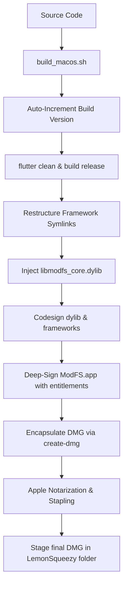

# 🔍 ModFS — High-Performance File Search for macOS

> **Lightning-fast native C search engine integrated with a premium Flutter interface.**

---

ModFS is a premium, high-performance desktop file search utility designed exclusively for macOS. A modernized fork of the acclaimed `Fsearch` indexing database, ModFS bridges a secure C-indexed core backend with a 120Hz declarative Flutter interface via Dart FFI (`libmodfs_core.dylib`). This architecture delivers search queries across millions of files in real time.

---

## 📖 Table of Contents
1. [Full Disk Access (FDA) Permission](#-full-disk-access-fda-permission)
2. [Foundational Configurations](#-foundational-configurations)
3. [Security Hardening & Sandbox Mitigations](#-security-hardening--sandbox-mitigations)
4. [Build & Release Pipeline](#-build--release-pipeline)

---

## 🔑 Full Disk Access (FDA) Permission

Because ModFS must index and monitor filesystem nodes, granting proper macOS permissions is critical:

> [!CAUTION]
> **Full Disk Access is Required**: By default, macOS's privacy sandbox blocks applications from scanning system and user documents directories. Without Full Disk Access (FDA), macOS will trigger a permission modal for every single folder during background indexing, locking up the search thread.

### How to Grant FDA:
1. Open macOS **System Settings**.
2. Navigate to **Privacy & Security** > **Full Disk Access**.
3. Authenticate, then click the **`+`** (plus) icon at the bottom of the application list.
4. Select **ModFS** from your `/Applications` folder and click **Open**.
5. Verify the toggle next to **ModFS** is switched **ON**.
6. Restart ModFS to apply settings.

---

## ⚙️ Foundational Configurations

Configure how ModFS queries and monitors files through the **Settings (Gear)** panel:

| Configuration Option | Parameters Managed | Operational Rationale & Benefit |
| :--- | :--- | :--- |
| **Include Paths** | Custom directory array (Defaults to user Home `/Users/username`) | Allows adding external volumes, secondary hard drives, and project directories. |
| **Exclude Paths** | Defending system exclusions (Defaults to `/proc`, `/sys`, `/dev`, `.cache`) | Prevents indexing loops and memory crashes in volatile system files. |
| **Database Rebuilds** | Purges existing indices and triggers manual FFI DB re-indexing | Cleans database cache and syncs newly updated path configurations. |
| **Preferences** | UI Theme selection (System/Dark/Light) and font size scaling. | Enhances accessibility and workspace integration. |

---

## 🔒 Security Hardening & Sandbox Mitigations

ModFS conforms to modern macOS development guidelines, utilizing entitlements to secure background threads:

| Security Safeguards | Entitlements / Configurations | System Auditing Benefit |
| :--- | :--- | :--- |
| **Sandbox Bypass** | `com.apple.security.app-sandbox` set to `false`. | Needed to query folders outside of isolated user spaces. |
| **Hardened Runtime** | Apple Hardened Runtime flag enabled globally. | Blocks dynamic code injections and execution of unsigned code. |
| **Library Validation Bypass** | `com.apple.security.cs.disable-library-validation` set to `true`. | Allows FFI to safely link with system-installed frameworks and Homebrew shared files without kernel kills. |
| **Local-First Processing** | Zero networking packages or API tracking. | Guarantees search logs and directories are never exfiltrated. |

---

## 🚢 Build & Release Pipeline

ModFS macOS release packages are compiled, signed, and notarized using `build_macos.sh`:

* **Dynamic FFI Core Injection**: The release script bundles the compiled native C database library `libmodfs_core.dylib` directly into `ModFS.app/Contents/Frameworks/` before code signing.
* **Apple Notarization**: The DMG installer is notarized via `notarytool` and stapled using `stapler` to ensure warning-free Gatekeeper approvals on startup.

---
*Copyright 2026 - Chuck Talk, Nordheim Online, LLC. Instant Desktop Telemetry.*
